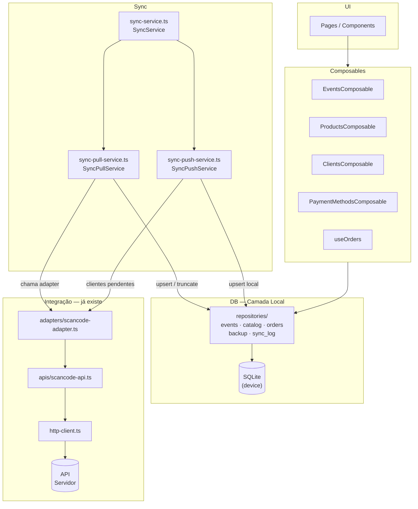

# Arquitetura Offline-First

**Versão:** 09/04/2026 (camada de sync alinhada a `specs/06-sync-services.md`)
**Stack:** NativeScript 9 · Vue 3 · TypeScript · SQLite

---

## Visão Geral

O app opera em **feiras sem internet**. A estratégia é:

- **Antes da feira (online):** pull de dados da API → SQLite local.
- **Durante a feira (offline):** toda leitura e escrita via SQLite. Zero chamadas de rede.
- **Após a feira (online):** push de pedidos criados offline → API (ação explícita — **sem push automático** “transparente” na V1).

---

## Hidratação `EventsComposable.refresh` (lista de eventos na UI)

`EventsComposable` mantém `events` em memória (estado estático). Para alinhar com o SQLite só há **dois** pontos de chamada a `EventsComposable.refresh()`:

| Gatilho | Ficheiro | Comportamento |
| --- | --- | --- |
| **`Application.launchEvent`** (`launch`) | `app/bootstrap/app.ts` | Se existir sessão (`getAuth()`), refresco dos composables de dados (`Events`, `Clients`, `Products`, `PaymentMethods`) a partir do SQLite. |
| **Sync pós-login** | `app/pages/LoginPage.vue` → `syncService.refresh()` → `syncPullService.refresh()` | `truncate` operacional (ordem FK) → pull de **events**, **products** (com `product_categories`), **clients**, **payment_methods**; `EventsComposable.refresh()` / `ProductsComposable.refresh()` / `PaymentMethodsComposable.refresh()` após os pulls correspondentes. *Alvo:* backup de pedidos assíncronos antes do wipe, `sync_log`, pull de **orders** / **order_items** — ainda não no código; mapa em `specs/06-sync-services.md`. |

**Contraponto:** com sessão guardada, o cold start pode fazer `refresh` no `launch` e outra vez após login noutra sessão — aceitável (dois `SELECT` curtos). Voltar da home do evento para a lista **não** dispara `refresh`; a lista usa o singleton já preenchido (se no futuro o schema passar a atualizar contagens no SQLite por tabela `events`, reavaliar).

---

## Documentação vs comentários no código

- **Preferir sempre** `specs/` e regras em `.cursor/rules/` para decisões de arquitetura, contratos e “quando chamar o quê”.
- **Evitar comentários** no código-fonte na grande maioria dos casos; só exceções pontuais quando o código não pode ser tornado autoexplicativo e a spec não cobre.

---

## Ciclo de login, logout e reset do banco

### Logout

- **Não** apaga dados do SQLite. Só limpa sessão/token (`clearAuth()` etc.).
- O banco permanece com eventos, catálogo, pedidos e backups até o próximo login.

### Login (após API autenticar com sucesso)

1. **Backup de pedidos assíncronos:** se existir **ao menos um** registro em `orders` com `synced_at IS NULL`, copiar **todos** esses pedidos e respectivos `order_items` para `orders_backup` / `order_items_backup` (**independente** de `sales_representative_id` — qualquer seller). Se **não** houver pedido assíncrono, este passo é no-op.
2. **Sem push automático** antes do wipe (nada de enviar pedidos “em silêncio” na V1).
3. **Wipe operacional:** apagar dados do “mundo sincronizado” do login anterior — tabelas operacionais (`events`, `product_categories`, `products`, `clients`, `payment_methods`, `orders`, `order_items`) e **reiniciar** `sync_log` conforme política definida (ex.: `DELETE` em todas as linhas). **Não** apagar `orders_backup` nem `order_items_backup` (acumulam histórico de resgates futuros).
4. **Pull completo (login):** na ordem de `specs/03-sync-pull.md` — `events` → `product_categories` → `products` → `clients` → `payment_methods` → **`orders`** → **`order_items`** (*alvo*; **implementação atual** do `syncPullService.refresh()` ainda **não** puxa `orders` / `order_items` após o truncate — ver `specs/06-sync-services.md`).

### Pedidos e seller (sem lógica extra de “identificação”)

- Se **não existir nenhuma** linha em `orders` antes do wipe → tratar como **sem contexto de seller anterior** (fluxo normal: backup no-op se não houver assíncronos, wipe, pull).
- Se **existir** pedido, `sales_representative_id` na linha já indica o vendedor responsável — **não** é necessário outro mecanismo de identificação no login. A regra de backup continua: qualquer `synced_at IS NULL` → backup antes do wipe, **independente** de quem está logando agora.

### Botão Sincronizar no Profile

- **`syncService.updateEntities()`** (implementação atual): primeiro **push** de clientes pendentes (`syncPushService`), depois **pull parcial** — `product_categories`/`products`, `clients`, `payment_methods` (sem `events`, sem `orders` / `order_items`).
- Novo evento na distribuidora continua a exigir fluxo com **pull de events** (ex.: novo login com `syncService.refresh()`), até haver outro gatilho na app.

---

## Diagrama de Camadas



---

## Responsabilidades por Camada

| Camada | Arquivo(s) | O que faz | O que NÃO faz |
|---|---|---|---|
| **HttpClient** | `integrations/http-client.ts` | Executa requisições HTTP, lida com timeout | Conhece endpoints ou negócio |
| **API** | `integrations/apis/scancode-api.ts` | Define endpoints, monta payloads, retorna DTOs | Trata erros de negócio |
| **Adapter** | `integrations/adapters/scancode-adapter.ts` | Regras de erro, limpa auth no 401, converte DTOs | Conhece Vue ou SQLite |
| **Repository** | `db/repositories/*.repo.ts` | CRUD no SQLite — único lugar com SQL | Conhece API ou Vue |
| **SyncService** | `sync/sync-service.ts` | Orquestrador: `refresh()` (login) delega no pull; `updateEntities()` (Profile) delega em `syncPushService.updateEntities()` + `syncPullService.updateEntities()`. | SQL direto; API direta |
| **SyncPullService** | `sync/sync-pull-service.ts` | Pull: adapter → repositórios; truncate em `refresh()`; `*Composable.refresh()` onde implementado (events, products, payment methods). **`sync_log` ainda não escrito aqui.** | Estado reativo (exceto refresh explícito); SQL direto |
| **SyncPushService** | `sync/sync-push-service.ts` | Push de clientes, produtos, meios de pagamento e pedidos (`updateOrders`) via adapter → realinhamento de PK onde aplicável → `upsert` local; `refreshOrderItems` após create de pedido. | Estado reativo |
| **Composable** | `composables/use*.ts` | Expõe `ref`s reativos para a UI, lê/escreve via repo | Chama API diretamente; contém SQL |
| **Page/Component** | `pages/**/*.vue` | Consome composables, renderiza UI | Contém lógica de negócio ou SQL |

---

## Regras de Ouro

1. **Composable nunca chama API diretamente** — passa pelo repositório (leitura) ou pelo sync (escrita em servidor).
2. **Repositório nunca conhece Vue** — sem `ref`, sem `reactive`, sem imports do Vue.
3. **SQL só existe em repositórios** — nenhuma outra camada escreve SQL.
4. **Push nunca re-consulta preços** — o `price` do `order_item` é o snapshot do momento da criação local.
5. **Pendentes de push:** `is_sync = 0` (e `remote_id IS NULL` onde aplicável ao fluxo de create) — ver `specs/04-sync-push.md`; não usar `synced_at` em `orders` como neste schema.
6. **Pull não bloqueia uso** — falha de pull não impede o app de funcionar com dados locais existentes.
7. **Adapter permanece agnóstico ao SQLite** — o adapter existente não é modificado para conhecer o banco local.

---

## Pacotes a Instalar

```bash
npm install @nativescript-community/sqlite
npm install @nativescript/connectivity
```

| Pacote | Uso |
|---|---|
| `@nativescript-community/sqlite` | Banco de dados local no device |
| `@nativescript/connectivity` | Detectar mudança de rede para disparar sync automático |

---

## Estrutura de Arquivos

```
app/
├── db/
│   ├── database.ts              # conexão singleton com o SQLite
│   ├── migrations.ts            # criação e versionamento das tabelas
│   ├── transactions.ts          # ex.: createOrderWithItems (transação orders + items)
│   └── repositories/
│       ├── events.repo.ts
│       ├── product-categories.repo.ts
│       ├── products.repo.ts
│       ├── clients.repo.ts
│       ├── payment-methods.repo.ts
│       ├── orders.repo.ts
│       ├── order-items.repo.ts
│       ├── orders-backup.repo.ts   # ou métodos no orders.repo — copiar assíncronos / wipe
│       └── sync-log.repo.ts
│
├── sync/
│   ├── sync-service.ts          # SyncService — orquestrador (login refresh, Profile updateEntities)
│   ├── sync-pull-service.ts     # SyncPullService — pull API → SQLite (+ truncate em refresh)
│   ├── sync-push-service.ts     # SyncPushService — push clientes, produtos, meios, pedidos → API
│
└── composables/
    ├── event-composable.ts     # EventsComposable
    ├── products-composable.ts  # ProductsComposable
    ├── clients-composable.ts       # ClientsComposable
    ├── payment-methods-composable.ts  # PaymentMethodsComposable
    └── useOrders.ts

specs/                           # este diretório — documentação técnica
```

---

## Fases de Implementação

| Fase | O que implementar | Depende de |
|---|---|---|
| **1** | Instalar pacotes + `db/database.ts` + `db/migrations.ts` | `specs/01-db-schema.md` |
| **2** | Todos os repositórios em `db/repositories/` | Fase 1 |
| **3** | Novos endpoints na API + funções no adapter para pull | Fase 2 |
| **4** | `sync/sync-pull-service.ts`, `sync/sync-push-service.ts`, `sync/sync-service.ts` — ver `06-sync-services.md` | Fase 3 |
| **5** | Composables (leitura do SQLite para UI) | Fase 2 |
| **6** | Push de pedidos já em `sync-push-service.ts` (`updateOrders`); ver `04-sync-push.md` | Fase 3 |

> As fases 4, 5 e 6 podem ser desenvolvidas em paralelo após a Fase 3.

---

## Fluxo de Uso Real

```
1. Login (online) — após auth OK
      ↓
2. **Alvo:** se houver orders com synced_at IS NULL → backup → wipe → pull completo (incl. orders/order_items). **Código atual:** `syncService.refresh()` → wipe + pull de events, catálogo e payment_methods (sem backup automático nem pull de pedidos) — `06-sync-services.md`.
      ↓
3. Usuário seleciona evento → feira (offline)
      ↓
4. App lê SQLite via composables; novos pedidos → id INTEGER autoincrement, synced_at = NULL
      ↓
5. Push explícito (ação do usuário / fluxo definido na implementação) → API
   Após sucesso: id e remote_id = id da API (realinhamento)
      ↓
6. Profile “Sincronizar” → `syncService.updateEntities()` — push clientes pendentes + pull parcial de catálogo (ver `06-sync-services.md`)
```
