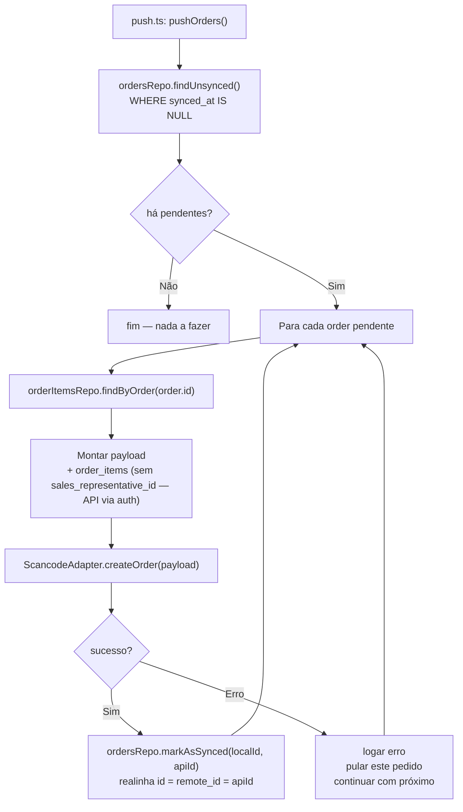

# Sync Push — SQLite → API

**Direção:** SQLite local → API

Este documento cobre: **(A)** o que está implementado em `app/sync/sync-push-service.ts` (**clientes**); **(B)** o **alvo** para **pedidos** (`app/sync/push.ts`, ainda inexistente). Mapa geral: `specs/06-sync-services.md`.

**Quando é executado:** ação **explícita** (ex.: “Sincronizar” no Profile chama `syncService.updateEntities()`, que inclui push de clientes). **Sem push automático** “transparente” na V1 (inclusive **não** enviar pedidos automaticamente no login).

---

## A) Implementado — `sync-push-service.ts` (`SyncPushService` / `syncPushService`)

**Responsabilidade:** enviar **clientes**, **produtos** e **meios de pagamento** com `is_sync = 0` para a API e gravar a resposta no SQLite.

- `*Repository.findAllUnsynced()` → por registro: `create*` ou `update*` no `ScancodeAdapter` → (só em **create**) `updateClientId` / `updateProductId` / `updatePaymentMethodId` com `(id local, id da API)` → `upsertOne` com payload completo.
- **Não tem estado reativo.** Não conhece Vue.
- Orquestrado por **`syncService.updateEntities()`** (Profile), **antes** do pull parcial de catálogo.

### PK local temporária e realinhamento (detalhe para agentes)

- Criação offline: repositórios atribuem **`id` negativo** quando o insert vem com `id` null (`RepositoryBase.allocateNextLocalNegativeId`).
- Até existir na API: **`remote_id` NULL**, **`is_sync = 0`**.
- Após **`POST`** bem-sucedido: o serviço chama **`update*Id(fromLocal, apiId)`** — `UPDATE … SET id = apiId WHERE id = fromLocal AND remote_id IS NULL` — para que FKs com **`ON UPDATE CASCADE`** (`orders`, `order_items`) sigam o novo id; em seguida **`upsertOne`** define `remote_id`, `is_sync` e o resto dos campos.

Documentação de regras para o agente: **`.cursor/rules/offline-architecture.mdc`** (secção *PK local temporária*).

---

## B) Alvo — `push.ts` (pedidos)

**Arquivo alvo:** `app/sync/push.ts` (ficheiro a criar quando o push de pedidos for implementado).

O `push.ts` leria os registros de pedidos criados offline (com `synced_at IS NULL`) e enviá-los à API.

- Lê pedidos pendentes via repositório.
- Monta o payload com os itens do pedido.
- Envia via adapter (que chama a API).
- **Realinha o pedido** com a API: após sucesso, `id` local e `remote_id` passam a ser o **mesmo** inteiro retornado pela API (`markAsSynced` migra PK e atualiza `order_items.order_id` em transação).
- **Não tem estado reativo.** Não conhece Vue.
- **Falha não bloqueia o app.** Registros permanecem com `synced_at IS NULL` para retry.

---

## Entidades que fazem push

| Entidade | Estado |
|---|---|
| **Clientes** | **Implementado** em `sync-push-service.ts` (pendentes → API → `updateClientId` se create → `upsertOne`). |
| **Produtos** | **Implementado** — mesmo padrão (`updateProductId` no create). |
| **Meios de pagamento** | **Implementado** — mesmo padrão (`updatePaymentMethodId` no create). |
| **`orders`** | **Alvo** em `push.ts` (secção B abaixo). |

`order_items` não têm push independente no desenho de pedidos — seriam enviados **embutidos no payload do pedido**. O backend criaria os itens junto com o pedido numa única requisição.

---

## Fluxo alvo — push de pedidos (`push.ts`)



---

## Payload de um Pedido

Tipos em `app/types/dtos/scancode-request.ts`: `OrderCreateRequestDTO` e `OrderCreateItemRequestDTO`.

```typescript
interface OrderCreateRequestDTO {
    event_id: number;
    client_id: number;
    payment_method_id: number;
    notes: string | null;
    buyer_name: string | null;
    buyer_phone: string | null;
    status: OrderStatus;                  // 'pending' | 'completed' | 'cancelled'
    order_items: OrderCreateItemRequestDTO[];
}

interface OrderCreateItemRequestDTO {
    product_id: number;
    price: number;                        // snapshot — não re-consultado
    qty: number;
    notes: string | null;
}
```

> **`sales_representative_id`** não vai no body do `POST /orders`. A API define o representante a partir do token (Bearer). O SQLite continua a guardar `sales_representative_id` no pedido local (preenchido na criação offline, p.ex. a partir de `getAuth()`), para relatórios e integridade local; na resposta do POST o campo vem preenchido e pode ser usado no `markAsSynced` / `upsert`.

---

## Política de Preço (imutabilidade)

O `price` do `order_item` no SQLite é um **snapshot** capturado no momento da criação local do pedido.

- **Nunca é re-consultado** no momento do push.
- Mesmo que o produto tenha mudado de preço na API durante a feira, o pedido mantém o preço original.
- Isso garante a integridade comercial: o vendedor negociou com o cliente aquele preço naquele momento.

---

## Política de Falha e Retry

```
Falha de rede:
  → pedido permanece com synced_at IS NULL
  → retry na próxima ação explícita de push

Erro 4xx da API (ex: cliente removido, produto inativo):
  → logar o erro com o id **local** (integer) do pedido
  → pular este pedido (não bloqueia os demais)
  → marcar como synced_at = 'ERROR' (futuro: status de erro específico)
  → exibir badge de "erro de sync" na UI (via composable useOrders)

Erro 5xx da API:
  → tratar como falha de rede — retry na próxima janela
```

> Esta versão usa retry simples (sem backoff exponencial). Se necessário no futuro, o orquestrador (`syncService` ou serviço dedicado) pode implementar backoff.

---

## Estrutura alvo do `push.ts` (pedidos)

```typescript
// app/sync/push.ts — a criar (exemplo alinhado ao contrato da API; métodos `findUnsynced` / `findByOrder` / `markAsSynced` ainda não existem nos repositórios)

import { getAuth } from '../persistence/auth-session';
import { OrderItemsRepository } from '../db/repositories/order-items.repo';
import { OrdersRepository } from '../db/repositories/orders.repo';
import { ScancodeAdapter } from '../integrations/adapters/scancode-adapter';
import type { OrderCreateRequestDTO } from '../types/dtos/scancode-request';

export async function pushOrders(): Promise<void> {
    if (getAuth() == null) {
        return;
    }

    const pending = await OrdersRepository.findUnsynced();

    if (pending.length === 0) {
        return;
    }

    for (const order of pending) {
        try {
            const items = await OrderItemsRepository.findByOrder(order.id);

            const payload: OrderCreateRequestDTO = {
                event_id: order.event_id,
                client_id: order.client_id,
                payment_method_id: order.payment_method_id as number,
                status: order.status,
                notes: order.notes,
                buyer_name: order.buyer_name,
                buyer_phone: order.buyer_phone,
                order_items: items.map((item) => ({
                    product_id: item.product_id,
                    price: item.price,
                    qty: item.qty,
                    notes: item.notes,
                })),
            };

            const created = await ScancodeAdapter.createOrder(payload);
            const apiId: number = created.id as number;
            await OrdersRepository.markAsSynced(order.id, apiId);

        } catch (err: unknown) {
            // Logar e continuar — não bloqueia os demais pedidos
            console.error(`[push] Falha ao sincronizar pedido local id=${order.id}:`, err);
        }
    }
}
```

---

## Camada de integração (pedidos) — implementado

- **`scancode-request.ts`:** `OrderCreateRequestDTO`, `OrderCreateItemRequestDTO` (body com `order_items`).
- **`scancode-response.ts`:** `OrderResponseDTO` = `{ data: OrderDTO }` (o pedido completo inclui `order_items` com `price` em string).
- **`scancode-api.ts`:** `postOrder(body)` → `POST /orders`.
- **`scancode-adapter.ts`:** `ScancodeAdapter.createOrder(payload)` → domínio `Order` (mapeamento partilhado com o pull de eventos).

---

## `markAsSynced(localOrderId, apiId)` — realinhamento de PK

Pedido ainda não enviado: `id` = inteiro **AUTOINCREMENT** local, `remote_id IS NULL`, `synced_at IS NULL`.

Após `POST` bem-sucedido com resposta `apiId` (= **fonte de verdade** na API):

1. Em **uma transação**: atualizar todas as linhas de `order_items` com `order_id = localOrderId` para `order_id = apiId`.
2. Atualizar `orders`: `id` de `localOrderId` para `apiId`, **`remote_id = apiId`**, `synced_at = now` (ISO 8601). Invariante pós-sync: **`id` = `remote_id` = id da API**.

> SQLite: se a plataforma não permitir mutar PK in-place, usar **delete + reinsert** do pedido e itens preservando dados, ou tabela temporária — decisão de implementação.

---

## Verificação antes do push de pedidos

O código que orquestrar o push de **pedidos** (UI ou serviço) deverá verificar antes de chamar `push.ts`:

1. Há conectividade de rede.
2. O usuário está autenticado (`getAuth()` não é null).
3. O banco foi inicializado (`getDatabase()` disponível).
