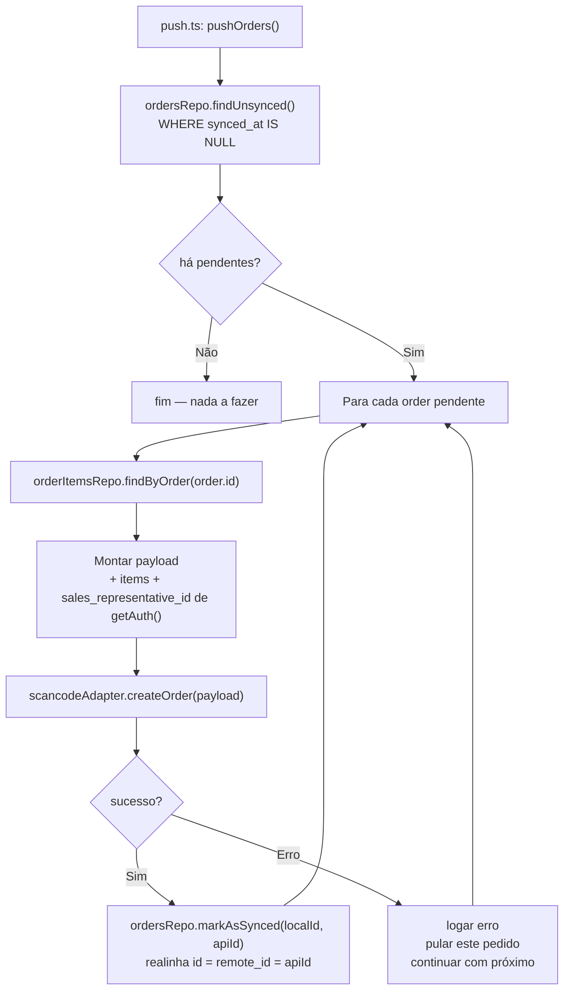

# Sync Push — SQLite → API

**Direção:** SQLite local → API

Este documento cobre: **(A)** o que está implementado em `app/sync/sync-push-service.ts` (**clientes**); **(B)** o **alvo** para **pedidos** (`app/sync/push.ts`, ainda inexistente). Mapa geral: `specs/06-sync-services.md`.

**Quando é executado:** ação **explícita** (ex.: “Sincronizar” no Profile chama `syncService.updateEntities()`, que inclui push de clientes). **Sem push automático** “transparente” na V1 (inclusive **não** enviar pedidos automaticamente no login).

---

## A) Implementado — `sync-push-service.ts` (`SyncPushService` / `syncPushService`)

**Responsabilidade:** enviar **clientes** marcados como não sincronizados no SQLite e gravar a versão devolvida/atualizada pela API.

- `ClientsRepository.findAllUnsynced()` → para cada registro, `ScancodeAdapter.updateClient(client)` → `ClientsRepository.upsertOne(updated)`.
- **Não tem estado reativo.** Não conhece Vue.
- Orquestrado por **`syncService.updateEntities()`** (Profile), **antes** do pull parcial de catálogo.

---

## B) Alvo — `push.ts` (pedidos)

**Arquivo alvo:** `app/sync/push.ts` (ficheiro a criar quando o push de pedidos for implementado).

O `push.ts` leria os registros de pedidos criados offline (com `synced_at IS NULL`) e enviá-los à API.

- Lê pedidos pendentes via repositório.
- Monta o payload com os itens do pedido.
- Envia via adapter (que chama a API).
- **Realinha o pedido** com a API: após sucesso, `id` local e `remote_id` passam a ser o **mesmo** inteiro retornado pela API (`markAsSynced` migra PK e atualiza `order_items.order_id` em transação).
- **Não tem estado reativo.** Não conhece Vue.
- **Falha não bloqueia o app.** Registros permanecem com `synced_at IS NULL` para retry.

---

## Entidades que fazem push

| Entidade | Estado |
|---|---|
| **Clientes** | **Implementado** em `sync-push-service.ts` (pendentes locais → API → upsert). |
| **`orders`** | **Alvo** em `push.ts` (secção B abaixo). |

`order_items` não têm push independente no desenho de pedidos — seriam enviados **embutidos no payload do pedido**. O backend criaria os itens junto com o pedido numa única requisição.

---

## Fluxo alvo — push de pedidos (`push.ts`)



---

## Payload de um Pedido

```typescript
interface CreateOrderPayload {
    event_id: number;                     // orders.event_id
    client_id: number;                    // orders.client_id
    payment_method_id: number;            // orders.payment_method_id
    sales_representative_id: number;      // de getAuth().sales_representative.id
    status: string;                       // orders.status
    notes: string | null;                 // orders.notes
    items: CreateOrderItemPayload[];
}

interface CreateOrderItemPayload {
    product_id: number;                   // order_items.product_id
    price: number;                        // order_items.price (snapshot — não re-consultado)
    qty: number;                          // order_items.qty
    notes: string | null;                 // order_items.notes
}
```

> **`sales_representative_id`** é injetado de `getAuth().sales_representative.id` no momento do push, não do banco local. Isso garante que sempre usa o ID correto do seller logado, mesmo que o campo `sales_representative_id` no SQLite seja redundante neste caso.

---

## Política de Preço (imutabilidade)

O `price` do `order_item` no SQLite é um **snapshot** capturado no momento da criação local do pedido.

- **Nunca é re-consultado** no momento do push.
- Mesmo que o produto tenha mudado de preço na API durante a feira, o pedido mantém o preço original.
- Isso garante a integridade comercial: o vendedor negociou com o cliente aquele preço naquele momento.

---

## Política de Falha e Retry

```
Falha de rede:
  → pedido permanece com synced_at IS NULL
  → retry na próxima ação explícita de push

Erro 4xx da API (ex: cliente removido, produto inativo):
  → logar o erro com o id **local** (integer) do pedido
  → pular este pedido (não bloqueia os demais)
  → marcar como synced_at = 'ERROR' (futuro: status de erro específico)
  → exibir badge de "erro de sync" na UI (via composable useOrders)

Erro 5xx da API:
  → tratar como falha de rede — retry na próxima janela
```

> Esta versão usa retry simples (sem backoff exponencial). Se necessário no futuro, o orquestrador (`syncService` ou serviço dedicado) pode implementar backoff.

---

## Estrutura alvo do `push.ts` (pedidos)

```typescript
// app/sync/push.ts — a criar

import { getAuth } from '../persistence/auth-session';
import * as scancodeAdapter from '../integrations/adapters/scancode-adapter';
import * as ordersRepo      from '../db/repositories/orders.repo';
import * as orderItemsRepo  from '../db/repositories/order-items.repo';
import type { CreateOrderPayload } from '../types/dtos/scancode-request';

export async function pushOrders(): Promise<void> {
    const pending = await ordersRepo.findUnsynced();

    if (pending.length === 0) {
        return;
    }

    const auth = getAuth();
    if (!auth) {
        return; // não deve acontecer se o chamador verificou auth antes
    }

    for (const order of pending) {
        try {
            const items = await orderItemsRepo.findByOrder(order.id);

            const payload: CreateOrderPayload = {
                event_id:                  order.event_id,
                client_id:                 order.client_id,
                payment_method_id:         order.payment_method_id,
                sales_representative_id:   auth.sales_representative.id,
                status:                    order.status,
                notes:                     order.notes,
                items: items.map((item) => ({
                    product_id: item.product_id,
                    price:      item.price,
                    qty:        item.qty,
                    notes:      item.notes,
                })),
            };

            const apiId: number = (await scancodeAdapter.createOrder(payload)).id;
            await ordersRepo.markAsSynced(order.id, apiId);

        } catch (err: unknown) {
            // Logar e continuar — não bloqueia os demais pedidos
            console.error(`[push] Falha ao sincronizar pedido local id=${order.id}:`, err);
        }
    }
}
```

---

## O que precisa ser adicionado na camada de integração (pedidos)

### `scancode-api.ts`

```typescript
export async function createOrder(payload: CreateOrderPayload): Promise<CreateOrderResponseDTO> {
    const { data } = await http.post<CreateOrderResponseDTO>('/orders', payload);
    return data;
}
```

### `scancode-adapter.ts`

```typescript
export async function createOrder(payload: CreateOrderPayload): Promise<CreateOrderResponseDTO> {
    try {
        return await scancodeApi.createOrder(payload);
    } catch (err: unknown) {
        handleApiError(err);
    }
}
```

### DTO de resposta esperado

```typescript
// app/types/dtos/scancode-response.ts — adicionar:
export interface CreateOrderResponseDTO {
    id: number;         // remote_id a ser gravado no SQLite
    status: string;
    // ... demais campos retornados pela API
}
```

---

## `markAsSynced(localOrderId, apiId)` — realinhamento de PK

Pedido ainda não enviado: `id` = inteiro **AUTOINCREMENT** local, `remote_id IS NULL`, `synced_at IS NULL`.

Após `POST` bem-sucedido com resposta `apiId` (= **fonte de verdade** na API):

1. Em **uma transação**: atualizar todas as linhas de `order_items` com `order_id = localOrderId` para `order_id = apiId`.
2. Atualizar `orders`: `id` de `localOrderId` para `apiId`, **`remote_id = apiId`**, `synced_at = now` (ISO 8601). Invariante pós-sync: **`id` = `remote_id` = id da API**.

> SQLite: se a plataforma não permitir mutar PK in-place, usar **delete + reinsert** do pedido e itens preservando dados, ou tabela temporária — decisão de implementação.

---

## Verificação antes do push de pedidos

O código que orquestrar o push de **pedidos** (UI ou serviço) deverá verificar antes de chamar `push.ts`:

1. Há conectividade de rede.
2. O usuário está autenticado (`getAuth()` não é null).
3. O banco foi inicializado (`getDatabase()` disponível).
