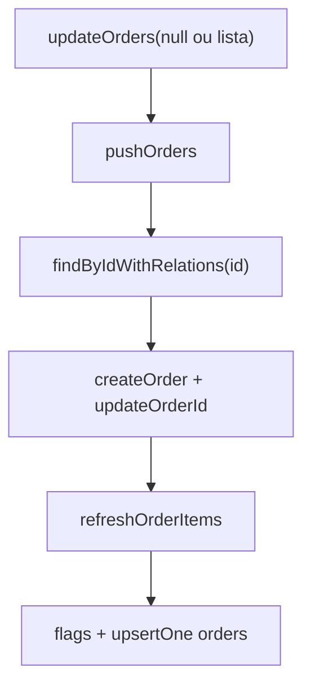

# Sync Push — SQLite → API

**Direção:** SQLite local → API

Documenta o comportamento **actual** de `app/sync/sync-push-service.ts` (`SyncPushService` / `syncPushService`) e os tipos/API usados no push. Mapa geral: `specs/06-sync-services.md`.

**Quando corre:** acção explícita — p.ex. “Sincronizar” no Profile chama `syncService.updateEntities()`, que faz push e depois pull parcial de catálogo (`specs/03-sync-pull.md`).

---

## O que `updateEntities()` faz (ordem)

1. `pushClients()`
2. `pushProducts()`
3. `pushPaymentMethods()`
4. `updateOrders(null)` — `null` ⇒ `OrdersRepository.findAllUnsynced()` (`orders.is_sync = 0`).

`updateOrders(orders: Order[] | null)` também aceita uma **lista** de pedidos em vez de `null`.

---

## Padrão comum (clientes, produtos, meios de pagamento)

- `*Repository.findAllUnsynced()` → por registro: `create*` ou `update*` no `ScancodeAdapter` → em **create** (`remote_id == null`) chama-se `updateClientId` / `updateProductId` / `updatePaymentMethodId` com `(id local, id da API)` → `upsertOne` com resposta.
- Sem estado reativo; sem Vue.

### PK local negativa (alinhamento com `orders` / `order_items`)

- `RepositoryBase.allocateNextLocalNegativeId` — usado em criação offline de **pedidos** (`OrdersRepository.createOne` insere `id` explícito negativo) e **linhas de pedido** (`OrderItemsRepository.createOne`).
- Enquanto não sincronizado com a API: `remote_id` do pedido **NULL**, `is_sync = 0` (SQLite integer).
- Após POST de entidade com PK a realinhar: `UPDATE … SET id = apiId WHERE id = fromLocal AND remote_id IS NULL`; FKs com **ON UPDATE CASCADE** (ex.: `order_items.order_id`, `orders.client_id`) acompanham.

Regras gerais offline: `.cursor/rules/offline-architecture.mdc`.

---

## Pedidos — `pushOrders` em `sync-push-service.ts`

Não existe `app/sync/push.ts`: o push de pedidos está no **mesmo** serviço que o resto.

Fluxo actual por entrada em `pushOrders` (resumo fiel ao código):

1. `OrdersRepository.findByIdWithRelations(orderPending.id)` — resultado tratado como `Order` (cast `as Order`; **não** há `continue` explícito se vier `null`).
2. Ramo `if (orderWithItems.remote_id == null || true)` — **em código actual** o `|| true` faz com que **sempre** se entre no ramo de **create**; o `else` com `updateOrder` está comentado e **nunca** é executado até remover esse `|| true` e implementar update.
3. `ScancodeAdapter.createOrder(orderWithItems)` — ver secção “Adapter” abaixo.
4. `OrdersRepository.updateOrderId(orderPending.id, order.id)` — troca PK local do pedido para o id devolvido pela API (`remote_id IS NULL` no `WHERE`).
5. `refreshOrderItems(order.id, order.order_items ?? [])` — apaga todas as linhas de `order_items` com esse `order_id`, depois `upsertMany` se a lista não for vazia (snapshot da resposta da API).
6. No objecto `order` em memória: `is_sync = true`, `remote_id = order.id`, `OrdersRepository.upsertOne(order)` (só colunas do cabeçalho `orders`; itens já foram gravados no passo 5).

Comentário no código: `refreshOrderItems` pode vir a ser movido para outro sítio (`//talvez alocar esta logica depois em outro lugar`).

### Itens e payload

- `order_items` **não** têm endpoint de push separado: vão no body do POST do pedido; após resposta, a persistência local dos itens é **substituída** pelo passo `refreshOrderItems` (delete + upsert do que a API devolveu).

---

## Diagrama (pedidos, conforme código)



---

## Payload `POST /orders`

Tipos: `app/types/dtos/scancode-request.ts` — `OrderCreateRequestDTO`, `OrderCreateItemRequestDTO`.

O adapter monta o body a partir do schema **`Order`** (`ScancodeAdapter.toOrderCreateRequestDTO`); o serviço de sync **não** monta DTO à mão.

```typescript
interface OrderCreateRequestDTO {
    event_id: number;
    client_id: number;
    payment_method_id: number | null;
    notes: string | null;
    buyer_name: string | null;
    buyer_phone: string | null;
    status: OrderStatus;
    order_items: OrderCreateItemRequestDTO[];
}
```

> **`sales_representative_id`** não vai no body; a API define-o a partir do token. O SQLite guarda o campo no pedido local para relatório / integridade.

---

## Camada de integração (pedidos)

- **`scancode-api.ts`:** `postOrder(body)` → `POST /orders`.
- **`scancode-adapter.ts`:** `createOrder(order: Order)` — `toOrderCreateRequestDTO(order)` → `postOrder` → `mapOrderDtoToDomain`.

---

## Política de preço (imutabilidade)

O `price` em `order_item` é **snapshot** à criação local; no push **não** se reconsulta o preço do produto.

---

## Falha / retry (alinhado a `is_sync`)

Pedidos pendentes: `is_sync = 0`. Falha na chamada à API → excepção / fluxo de erro do adapter; o registo **não** é marcado como sincronizado nesse ciclo (não há `synced_at` na tabela `orders` neste schema).

---

## Verificação antes de expor sync na UI

Conectividade, utilizador autenticado, base inicializada — conforme produto.

---

## Histórico / desenho antigo (não é o código actual)

Existiu a ideia de `app/sync/push.ts`, `findUnsynced` por `synced_at`, `markAsSynced` e montagem de `OrderCreateRequestDTO` no próprio push — **não** corresponde ao repositório/serviço actuais; usar este documento e `sync-push-service.ts` como fonte.
