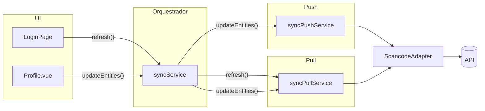

# Sync — ficheiros, orquestração e gatilhos

**Diretório:** `app/sync/`  
**Objetivo deste documento:** descrever a **implementação atual** da camada de sincronização (pull/push e orquestrador), alinhada ao código; e um quadro **alvo vs código** para specs mais antigas (`00-architecture`, `03`, `04`).

---

## Ficheiros e exports

| Ficheiro | Classe | Instância exportada | Papel |
| --- | --- | --- | --- |
| `sync-service.ts` | `SyncService` | `syncService` | **Orquestrador** usado pela UI: combina push e pull conforme o caso. |
| `sync-pull-service.ts` | `SyncPullService` | `syncPullService` | Pull API → SQLite (truncate quando aplicável, upserts). |
| `sync-push-service.ts` | `SyncPushService` | `syncPushService` | Push SQLite → API para entidades com política local (hoje: **clientes** pendentes). |

**Padrão:** igual em pull e push — `private static readonly _instance`, `private constructor()`, `getInstance()`, e export da instância (`syncPullService`, `syncPushService`). O `SyncService` segue o mesmo padrão com `syncService`.

**Regra para código novo:** páginas e componentes devem preferir **`syncService`** como entrada única, exceto testes ou casos que precisem só de pull ou só de push.

---

## Grafo de chamadas (implementação)

---

## API pública por serviço

### `syncService` (`sync-service.ts`)

| Método | Comportamento |
| --- | --- |
| `refresh()` | Delega em `syncPullService.refresh()`. |
| `updateEntities()` | `await syncPushService.updateEntities()` **depois** `await syncPullService.updateEntities()` (push local primeiro, depois pull de catálogo). |

### `syncPullService` (`sync-pull-service.ts`)

| Método | Comportamento |
| --- | --- |
| `refresh()` | 1) `truncateAllEntities()` — ordem FK: `order_items` → `orders` → `products` → `product_categories` → `clients` → `payment_methods` → `events`. 2) `pullEvents()` → `pullProducts()` (deriva categorias dos produtos e faz upsert em `product_categories` + `products`) → `pullClients()` → `pullPaymentMethods()`. |
| `updateEntities()` | **Sem truncate.** Apenas `pullProducts()` → `pullClients()` → `pullPaymentMethods()` (equivalente ao “catálogo parcial” da spec; **não** atualiza `events`). |

Após gravação no SQLite, o código chama **`EventsComposable.refresh()`**, **`ProductsComposable.refresh()`** e **`PaymentMethodsComposable.refresh()`** nos pulls correspondentes. **`ClientsComposable.refresh()` não é chamado** após `pullClients()` — a lista em memória só é hidratada no cold start com sessão (`Application.launchEvent`) até existir um gatilho explícito (backlog).

### `syncPushService` (`sync-push-service.ts`)

| Método | Comportamento |
| --- | --- |
| `updateEntities()` | `ClientsRepository.findAllUnsynced()` → para cada cliente, `ScancodeAdapter.updateClient(client)` → `ClientsRepository.upsertOne(updated)`. |

---

## Onde a UI dispara o sync

| Ecrã / ação | Chamada | Efeito resumido |
| --- | --- | --- |
| **Login** (após `setAuth`) | `syncService.refresh()` | Wipe operacional + pull de eventos, produtos (e categorias), clientes, métodos de pagamento. |
| **Profile — “Sincronizar”** | `syncService.updateEntities()` | Push de clientes pendentes + pull parcial de catálogo (produtos/categorias, clientes, métodos de pagamento). |

---

## Integração com o adapter e repositórios

- **Pull:** `SyncPullService` usa apenas **`ScancodeAdapter`** (e repositórios). Não contém SQL; não mantém estado Vue, exceto as chamadas controladas a `*Composable.refresh()` descritas acima.
- **Push:** `SyncPushService` usa **`ScancodeAdapter.updateClient`** e **`ClientsRepository`**.
- **`sync_log`:** a escrita em `sync_log` após cada entidade, descrita como alvo em `specs/03-sync-pull.md`, **não está ligada** nestes serviços no código atual (ver quadro abaixo).

---

## Alvo arquitetural (outras specs) vs código atual

Use esta tabela para interpretar `00-architecture.md`, `03-sync-pull.md` e `04-sync-push.md` sem assumir que tudo já está implementado.

| Tópico | Alvo / documentado noutras specs | Estado no código |
| --- | --- | --- |
| Backup de `orders` com `synced_at IS NULL` antes do wipe no login | Sim (`00-architecture`) | **Não implementado** — tabelas de backup existem nas migrations, mas o fluxo de login não as popula. |
| Pull de `orders` / `order_items` após login | Sim (ordem 6–7 em `03`) | **Não implementado** — `refresh()` faz truncate dessas tabelas mas **não** as repovoa pela API. |
| `sync_log` / `pulled_at` após cada pull | Descrito em `03` | **Não implementado** no `app/sync/*`. |
| Push de **pedidos** (`push.ts`, `pushOrders`) | `04-sync-push.md` | **Não implementado** — ficheiro `app/sync/push.ts` não existe. |
| Push de **clientes** offline | Não era o foco original de `04` | **Implementado** em `sync-push-service.ts`. |
| Profile só pull de catálogo | `00-architecture` (regra antiga) | **Atual:** Profile faz **push de clientes** + **pull parcial** via `syncService.updateEntities()`. |

Quando as linhas acima forem implementadas, actualizar esta tabela e reduzir notas de “alvo” em `03`/`04`/`00`.

---

## Leitura cruzada

| Documento | Conteúdo |
| --- | --- |
| `specs/00-architecture.md` | Visão offline-first, login/logout, diagrama de camadas. |
| `specs/03-sync-pull.md` | Ordem de pull, upsert, entidades, **comportamento alvo** (incl. `sync_log`, orders). |
| `specs/04-sync-push.md` | Contrato alvo para **pedidos**; secção sobre clientes / `sync-push-service` alinhada ao código. |
| `specs/05-composables.md` | Onde `*Composable.refresh()` é chamado. |

---

**Última revisão (alinhamento ao código):** 2026-04-09
