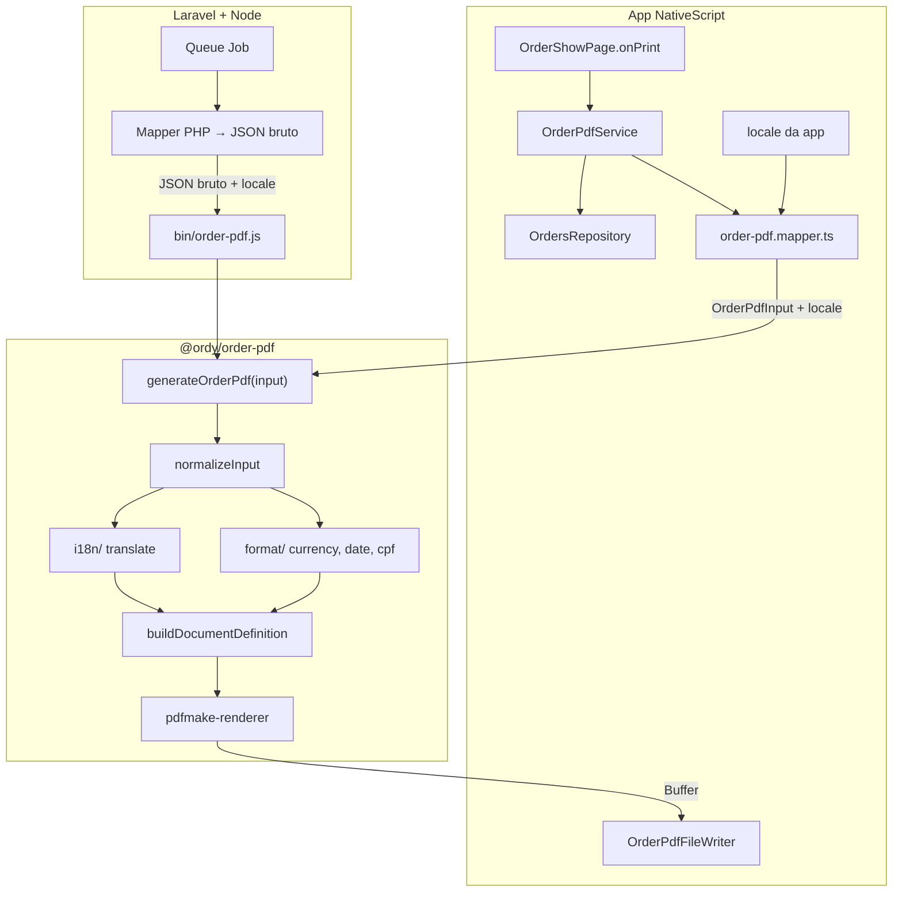

# Order PDF Engine — arquitetura e plano de implementação

**Versão:** 23/05/2026 (rev. 2 — DTO bruto + i18n/format no pacote)  
**Stack do pacote:** TypeScript · Node 18+ · pdfmake  
**Consumidores alvo:** app NativeScript (device) · servidor Node junto a Laravel  
**Estado:** planejamento — **não implementado** (inclui `packages/order-pdf/README.md` — ver secção abaixo)

---

## Objetivo

Gerar um ficheiro PDF a partir dos dados de um pedido comercial, de forma **agnóstica ao runtime**:

- **Input:** JSON `OrderPdfInput` — DTO com **dados brutos** + `locale`.
- **Output:** bytes do PDF + nome de ficheiro sugerido.

O motor **não** conhece Vue, NativeScript, SQLite, Laravel nem Eloquent. Quem chama só serializa o pedido e indica o idioma. **Tradução dos labels do PDF e formatação BR/en ficam dentro do pacote.**

---

## Decisão de alocação (V1)

### Recomendação adotada nesta spec

| Peça | Local | Motivo |
| --- | --- | --- |
| **Engine (pacote npm)** | `packages/order-pdf/` na raiz do repo | Segregado do app; instalável via npm; reutilizável no Laravel |
| **i18n + formatação do PDF** | `packages/order-pdf/src/i18n/` e `src/format/` | Uma única fonte de verdade para app e Laravel |
| **Ligação ao monorepo** | `workspaces: ["packages/*"]` no `package.json` raiz | `npm install` resolve `@ordy/order-pdf` localmente sem publish |
| **Adaptadores mobile** | `app/services/order-pdf/` | Leitura SQLite, mapper **só extrai campos brutos**, gravação com `@nativescript/core` |
| **Gatilho UI (V1)** | `OrderShowPage.vue` → `onPrint()` | Botão já existe; stub `console.log('Print tapped')` |

### Nome do pacote

- **npm:** `@ordy/order-pdf`
- **Import no app:** `import { generateOrderPdf } from '@ordy/order-pdf';`

---

## Mudança de abordagem (rev. 2)

### Antes (rev. 1 — descartada)

Caller enviava strings já traduzidas e formatadas. Duplicava lógica entre app (`Format` + vue-i18n) e Laravel (helpers PHP).

### Agora (rev. 2 — adotada)

| Camada | Responsabilidade |
| --- | --- |
| **Caller** (app / Laravel) | Buscar dados; montar `OrderPdfInput` com valores **brutos**; passar `locale` |
| **Pacote** | Traduzir labels; formatar moeda, datas, CPF/CNPJ; montar layout; gerar PDF |

### Por que faz sentido

- **DRY:** formatação e textos do PDF existem **uma vez**, no pacote.
- **Laravel simplificado:** serializa Eloquent → JSON + `"locale": "pt-BR"` — sem helpers PHP de PDF.
- **Paridade garantida:** PDF idêntico no device e no servidor (mesma versão do pacote).
- **Ainda agnóstico:** pacote não sabe se veio de SQLite ou MySQL — só recebe JSON.

### Trade-offs aceites

| Prós | Contras |
| --- | --- |
| Menos código nos callers | Pacote cresce (i18n + format) |
| Testes de formatação centralizados | Mudar texto do PDF = bump do pacote |
| Locale único no input | App UI e PDF podem ter locales diferentes (ver abaixo) |

**Nota:** toasts da app (`"PDF gerado com sucesso"`) continuam no **vue-i18n do app** — só o **conteúdo impresso no PDF** usa i18n do pacote.

---

## Princípios de arquitetura

1. **Engine agnóstica de framework** — zero imports de Vue, NativeScript, SQLite, Laravel.
2. **DTO bruto na fronteira** — números, enums, ISO dates, CPF/CNPJ sem máscara (ou dígitos).
3. **Locale explícito** — `locale: 'pt-BR' | 'en'` no input; pacote resolve tradução e formatação.
4. **Preço imutável** — itens usam `unitPrice` do snapshot (`order_items.price`); nunca preço atual do catálogo.
5. **Pipeline interno** — `input → normalize → translate + format → layout → render`.
6. **Testes no pacote** — fixture JSON bruto + locale → PDF; testes unitários de formatters e i18n.

---

## Diagrama de camadas



---

## Contrato de dados

### Input público — `OrderPdfInput`

Ficheiro: `packages/order-pdf/src/types/order-pdf-input.ts`.

```typescript
/** Locales suportados na V1. Expandir = novo ficheiro em src/i18n/locales/ */
export type OrderPdfLocale = 'pt-BR' | 'en';

export type OrderPdfStatus = 'pending' | 'completed' | 'cancelled';

export interface OrderPdfInputLineItem {
    sku: string;
    name: string;
    category: string;
    qty: number;
    unitPrice: number;   // bruto: 10.5 — snapshot do item, não do catálogo
}

export interface OrderPdfInput {
    locale: OrderPdfLocale;
    meta: {
        orderNumber: string | number;
        createdAt: string;        // ISO 8601: "2026-05-23T14:30:00.000Z" ou "2026-05-23"
        status: OrderPdfStatus;   // enum — pacote traduz
        eventName?: string;
    };
    client: {
        fantasyName: string;
        corporateName: string;
        cpfCnpj: string;          // bruto ou com máscara — pacote normaliza e formata
        phone: string;
        buyerName?: string | null;
    };
    items: OrderPdfInputLineItem[];
    paymentMethod?: string | null;  // nome já vindo do domínio (ex.: "PIX")
    notes?: string | null;
    signatureImageBase64?: string | null;
}
```

### Output — `OrderPdfResult`

```typescript
export interface OrderPdfResult {
    buffer: Buffer;
    suggestedFileName: string;  // ex.: "pedido-123.pdf"
}
```

### Modelo interno (não exportar na V1)

`OrderPdfViewModel` — produzido por `mapInputToViewModel(input)` com strings traduzidas e formatadas. Usado só dentro do pacote por `buildDocumentDefinition()`.

### Regra do contrato

| Responsabilidade | Quem faz |
| --- | --- |
| Buscar pedido + relações | Caller |
| Extrair campos brutos → `OrderPdfInput` | Caller (mapper fino) |
| Escolher `locale` | Caller (app: locale vue-i18n; Laravel: `app()->getLocale()`) |
| Traduzir labels do PDF | **Pacote** (`src/i18n/`) |
| Formatar moeda, data, CPF/CNPJ | **Pacote** (`src/format/`) |
| Calcular `lineTotal` e `grandTotal` | **Pacote** (a partir de `qty * unitPrice`) |
| Layout e bytes PDF | **Pacote** |

Depois que o JSON entra na engine, o processo **não sabe** se foi Laravel ou NativeScript — só vê DTO + locale.

---

## i18n dentro do pacote

### Estrutura

```
packages/order-pdf/src/i18n/
├── index.ts              # translate(locale, key, params?)
├── locales/
│   ├── pt-BR.json
│   └── en.json
└── keys.ts               # type-safe keys (opcional V1)
```

### Chaves V1 (`locales/pt-BR.json`)

```json
{
  "title": "Pedido",
  "client": "Cliente",
  "buyer": "Comprador",
  "payment": "Forma de pagamento",
  "notes": "Observações",
  "total": "Total",
  "signature": "Assinatura",
  "itemsHeader": {
    "product": "Produto",
    "qty": "Qtd",
    "unit": "Unit.",
    "total": "Total"
  },
  "status": {
    "pending": "Aberto",
    "completed": "Concluído",
    "cancelled": "Cancelado"
  },
  "filename": "pedido-{orderNumber}.pdf"
}
```

### Implementação (sem vue-i18n)

Helper leve, zero dependências:

```typescript
// translate('pt-BR', 'status.pending') → "Aberto"
// translate('en', 'filename', { orderNumber: 123 }) → "order-123.pdf"
```

Ficheiros JSON **embutidos no build** (import ou `readFileSync` em Node; copiar para `dist/` no `tsc`).

**Não** reutilizar `app/locales/*.json` na V1 — evita acoplamento app ↔ pacote. Backlog: script de sync de chaves se quiserem alinhar textos.

---

## Formatação dentro do pacote

### Estrutura

```
packages/order-pdf/src/format/
├── index.ts
├── currency.ts      # formatCurrency(locale, value: number)
├── date.ts          # formatDate(locale, iso: string)
├── cpf-cnpj.ts      # formatCpfCnpj(locale, raw: string)
└── locale-config.ts # pt-BR: R$, dd/mm/yyyy; en: $, mm/dd/yyyy (se aplicável)
```

### Comportamento V1

| Função | `pt-BR` | `en` |
| --- | --- | --- |
| `formatCurrency` | `R$ 1.234,56` (espelha lógica de `app/utils/format.ts`) | `R$ 1,234.56` ou `BRL 1,234.56` — definir na implementação |
| `formatDate` | `23/05/2026` | `05/23/2026` |
| `formatCpfCnpj` | `12.345.678/0001-90` / CPF | mesmo formato ou raw — V1 pode manter máscara BR em ambos |

**Referência:** alinhar `formatCurrency` / `formatCpfCnpj` com `app/utils/format.ts` para paridade visual app ↔ PDF em pt-BR.

Usar `Intl.NumberFormat` onde fizer sentido; CPF/CNPJ com funções puras (sem deps).

---

## Pipeline interno do pacote

```typescript
export async function generateOrderPdf(input: OrderPdfInput): Promise<OrderPdfResult> {
    const normalized = normalizeInput(input);       // validação, defaults, cpf dígitos
    const viewModel = mapInputToViewModel(normalized); // i18n + format
    const docDefinition = buildDocumentDefinition(viewModel);
    const buffer = await renderPdf(docDefinition);
    const suggestedFileName = translate(normalized.locale, 'filename', {
        orderNumber: String(normalized.meta.orderNumber),
    });
    return { buffer, suggestedFileName };
}
```

---

## API pública do pacote

```typescript
// packages/order-pdf/src/index.ts
export { generateOrderPdf } from './generate-order-pdf';
export type {
    OrderPdfInput,
    OrderPdfInputLineItem,
    OrderPdfLocale,
    OrderPdfStatus,
    OrderPdfResult,
} from './types/order-pdf-input';

// opcional — testes ou CLI debug:
export { mapInputToViewModel } from './map/map-input-to-view-model';
export { formatCurrency, formatDate, formatCpfCnpj } from './format';
export { translate } from './i18n';
```

---

## Biblioteca: pdfmake

| Critério | pdfmake |
| --- | --- |
| Node puro | Sim |
| Sem DOM (NativeScript) | Sim — `getBuffer()` |
| Tabelas de itens | Declarativo |
| Imagem (assinatura) | base64 no layout |

**Dependência:** `"pdfmake": "^0.2.10"` — só no pacote.

**Fontes:** `packages/order-pdf/src/fonts/roboto-vfs.ts`.

---

## Estrutura de ficheiros

### Pacote (`packages/order-pdf/`)

```
packages/order-pdf/
├── package.json
├── tsconfig.json
├── src/
│   ├── index.ts
│   ├── generate-order-pdf.ts
│   ├── types/
│   │   └── order-pdf-input.ts
│   ├── normalize/
│   │   └── normalize-input.ts
│   ├── map/
│   │   └── map-input-to-view-model.ts
│   ├── i18n/
│   │   ├── index.ts
│   │   ├── keys.ts
│   │   └── locales/
│   │       ├── pt-BR.json
│   │       └── en.json
│   ├── format/
│   │   ├── index.ts
│   │   ├── currency.ts
│   │   ├── date.ts
│   │   ├── cpf-cnpj.ts
│   │   └── locale-config.ts
│   ├── layout/
│   │   └── build-document-definition.ts
│   ├── render/
│   │   └── pdfmake-renderer.ts
│   └── fonts/
│       └── roboto-vfs.ts
├── bin/
│   └── order-pdf.js
├── README.md                  # criar na implementação — conteúdo obrigatório na secção "README do pacote"
└── test/
    ├── fixtures/
    │   ├── sample-order.pt-BR.json
    │   └── sample-order.en.json
    ├── format.test.ts
    ├── i18n.test.ts
    └── generate-order-pdf.test.ts
```

### App NativeScript (`app/services/order-pdf/`)

```
app/services/order-pdf/
├── order-pdf.service.ts       # repo → mapper → generateOrderPdf → file writer
├── order-pdf.mapper.ts        # Order → OrderPdfInput (campos brutos + locale)
└── order-pdf-file-writer.ts   # knownFolders.documents()
```

**Regras:**

- Mapper **não** usa `Format` nem `$t()` para conteúdo do PDF.
- Mapper passa `locale` a partir do idioma ativo da app (ex.: composable i18n).
- Páginas Vue só chamam `OrderPdfService`.
- Toasts de sucesso/erro continuam em `app/locales/*.json` (UI, não PDF).

### Exemplo mapper (app)

```typescript
import type { OrderPdfInput, OrderPdfLocale } from '@ordy/order-pdf';
import type { Order } from '../../types/schema/order';

export function mapOrderToPdfInput(
    order: Order,
    locale: OrderPdfLocale,
    eventName?: string,
    paymentMethodName?: string,
): OrderPdfInput {
    return {
        locale,
        meta: {
            orderNumber: order.id ?? order.remote_id ?? '—',
            createdAt: order.created_at,
            status: order.status,
            eventName,
        },
        client: {
            fantasyName: order.client?.fantasy_name ?? '',
            corporateName: order.client?.corporate_name ?? '',
            cpfCnpj: order.client?.cpf_cnpj ?? '',
            phone: order.client?.phone ?? '',
            buyerName: order.buyer_name,
        },
        items: (order.order_items ?? []).map((item) => ({
            sku: item.product?.sku ?? '',
            name: item.product?.name ?? '',
            category: item.product?.product_category?.name ?? '',
            qty: item.qty,
            unitPrice: item.price,
        })),
        paymentMethod: paymentMethodName ?? null,
        notes: order.notes,
    };
}
```

---

## README do pacote (`packages/order-pdf/README.md`)

**Não criar agora.** Na implementação do pacote (Fase 1), criar `packages/order-pdf/README.md` com o conteúdo abaixo — é o guia de uso para quem instala via npm (NativeScript ou Laravel). Esta secção da spec é o **roteiro** do que o README deve conter.

### Estrutura obrigatória do README

| Secção | Conteúdo |
| --- | --- |
| Intro | Input/output, link para `specs/07-order-pdf-engine.md` |
| Instalação | monorepo, npm publish, Laravel + Node 18+ |
| API + contrato | `OrderPdfInput`, JSON de exemplo |
| CLI | flags, teste local |
| **Uso em NativeScript** | mapper, service, file writer, `onPrint` |
| **Uso em Laravel** | mapper PHP, Job, Controller; opções A/B/C |
| Locales | pt-BR, en |
| Desenvolvimento | build, test |

---

### Conteúdo — Intro (README)

```markdown
# @ordy/order-pdf

Pacote npm para gerar PDF de pedidos. Agnóstico de runtime — Node (Laravel) ou webpack (NativeScript).

- **Input:** `OrderPdfInput` — DTO bruto + `locale`
- **Output:** `Buffer` + `suggestedFileName`
- **Internamente:** i18n, formatação, layout pdfmake
```

---

### Conteúdo — Instalação (README)

**Monorepo:**

```json
{
  "workspaces": ["packages/*"],
  "dependencies": { "@ordy/order-pdf": "workspace:*" }
}
```

**Laravel:**

```bash
npm install @ordy/order-pdf@^0.1.0
```

Requisito: **Node 18+** no servidor Laravel.

---

### Conteúdo — API (README)

```typescript
import { generateOrderPdf, type OrderPdfInput } from '@ordy/order-pdf';

const { buffer, suggestedFileName } = await generateOrderPdf(input);
```

JSON de exemplo (fixture em `test/fixtures/sample-order.pt-BR.json`):

```json
{
  "locale": "pt-BR",
  "meta": {
    "orderNumber": 123,
    "createdAt": "2026-05-23T10:00:00.000Z",
    "status": "completed",
    "eventName": "Feira SP 2026"
  },
  "client": {
    "fantasyName": "Loja Exemplo",
    "corporateName": "Exemplo LTDA",
    "cpfCnpj": "12345678000190",
    "phone": "11999999999",
    "buyerName": "João Silva"
  },
  "items": [
    { "sku": "SKU-001", "name": "Produto A", "category": "Cat X", "qty": 2, "unitPrice": 10.5 }
  ],
  "paymentMethod": "PIX",
  "notes": "Entregar na portaria"
}
```

---

### Conteúdo — Uso em NativeScript (README)

No device **não corre Node** — webpack empacota o pacote. Gravação de ficheiro fica na app.

#### `order-pdf.mapper.ts`

```typescript
import type { OrderPdfInput, OrderPdfLocale } from '@ordy/order-pdf';
import type { Order } from '../../types/schema/order';

export function mapOrderToPdfInput(
    order: Order,
    locale: OrderPdfLocale,
    eventName?: string,
    paymentMethodName?: string,
): OrderPdfInput {
    return {
        locale,
        meta: {
            orderNumber: order.id ?? order.remote_id ?? '—',
            createdAt: order.created_at,
            status: order.status,
            eventName,
        },
        client: {
            fantasyName: order.client?.fantasy_name ?? '',
            corporateName: order.client?.corporate_name ?? '',
            cpfCnpj: order.client?.cpf_cnpj ?? '',
            phone: order.client?.phone ?? '',
            buyerName: order.buyer_name,
        },
        items: (order.order_items ?? []).map((item) => ({
            sku: item.product?.sku ?? '',
            name: item.product?.name ?? '',
            category: item.product?.product_category?.name ?? '',
            qty: item.qty,
            unitPrice: item.price,
        })),
        paymentMethod: paymentMethodName ?? null,
        notes: order.notes,
    };
}
```

#### `order-pdf-file-writer.ts`

```typescript
import { File, knownFolders } from '@nativescript/core';

export class OrderPdfFileWriter {
    public static save(bytes: ArrayBuffer | Uint8Array, fileName: string): string {
        const file = knownFolders.documents().getFile(fileName);
        file.writeSync(bytes);
        return file.path;
    }
}
```

#### `order-pdf.service.ts`

```typescript
import { generateOrderPdf, type OrderPdfLocale } from '@ordy/order-pdf';
import { getLocale } from '../../configs/i18n';
import { OrdersRepository } from '../../db/repositories/orders.repo';
import { PaymentMethodsComposable } from '../../composables/payment-methods-composable';
import { useCurrentEvent } from '../../composables/repository/useCurrentEvent';
import { mapOrderToPdfInput } from './order-pdf.mapper';
import { OrderPdfFileWriter } from './order-pdf-file-writer';

export class OrderPdfService {
    public static async generateForOrderId(orderId: number): Promise<string> {
        const order = await OrdersRepository.findByIdWithRelations(orderId);
        if (!order) throw new Error(`Order ${orderId} not found`);

        const locale: OrderPdfLocale = getLocale() === 'en' ? 'en' : 'pt-BR';
        const eventName = useCurrentEvent.getEvent()?.value?.name;
        const pmId = order.payment_method_id;
        const paymentMethodName = pmId
            ? PaymentMethodsComposable.getList().value.find((m) => m.id === pmId)?.name
            : undefined;

        const input = mapOrderToPdfInput(order, locale, eventName, paymentMethodName);
        const { buffer, suggestedFileName } = await generateOrderPdf(input);
        return OrderPdfFileWriter.save(buffer, suggestedFileName);
    }
}
```

#### `OrderShowPage.vue` — `onPrint`

```typescript
async function onPrint(): Promise<void> {
    const orderId = currentOrderRef.value?.id;
    if (typeof orderId !== 'number') return;

    try {
        const filePath = await OrderPdfService.generateForOrderId(orderId);
        showToast({ message: t('pages.orderShow.pdfSuccess'), variant: 'success' });
    } catch {
        showToast({ message: t('pages.orderShow.pdfError'), variant: 'error' });
    }
}
```

---

### Conteúdo — Uso em Laravel (README)

PHP **não** executa o pacote. Laravel monta JSON bruto e chama **Node**.

| Runtime | Node? |
| --- | --- |
| NativeScript | Não |
| Laravel | **Sim** (18+) |

#### Opção A — Job + CLI (V1)

**Mapper** — `app/Services/OrderPdfInputMapper.php`:

```php
public function toArray(Order $order, string $locale = 'pt-BR'): array
{
    $order->loadMissing(['client', 'items.product.category', 'event', 'paymentMethod']);

    return [
        'locale' => $locale === 'en' ? 'en' : 'pt-BR',
        'meta' => [
            'orderNumber' => $order->id,
            'createdAt' => $order->created_at->toIso8601String(),
            'status' => $order->status,
            'eventName' => $order->event?->name,
        ],
        'client' => [
            'fantasyName' => $order->client->fantasy_name ?? '',
            'corporateName' => $order->client->corporate_name ?? '',
            'cpfCnpj' => $order->client->cpf_cnpj ?? '',
            'phone' => $order->client->phone ?? '',
            'buyerName' => $order->buyer_name,
        ],
        'items' => $order->items->map(fn ($item) => [
            'sku' => $item->product->sku ?? '',
            'name' => $item->product->name ?? '',
            'category' => $item->product->category->name ?? '',
            'qty' => $item->qty,
            'unitPrice' => (float) $item->price,
        ])->values()->all(),
        'paymentMethod' => $order->paymentMethod?->name,
        'notes' => $order->notes,
    ];
}
```

**Job** — grava JSON, invoca CLI:

```php
$cli = base_path('node_modules/@ordy/order-pdf/bin/order-pdf.js');
Process::run(['node', $cli, '--input', $jsonPath, '--output', $pdfPath]);
```

**Controller:**

```php
return response()->download($pdfPath, "pedido-{$id}.pdf");
```

#### Opção B — script `.mjs` com `generateOrderPdf()` importado

#### Opção C — microserviço Node HTTP (V2)

---

### Conteúdo — CLI (README)

```bash
node node_modules/@ordy/order-pdf/bin/order-pdf.js -i order.json -o pedido.pdf
```

| Flag | Descrição |
| --- | --- |
| `--input` / `-i` | JSON `OrderPdfInput` |
| `--output` / `-o` | Caminho PDF |
| `--locale` / `-l` | Override opcional |

---

## Fluxo Laravel + Node (resumo)

Laravel envia **mesmo DTO bruto** que o NativeScript. No servidor invoca Node via subprocess; no device importa `generateOrderPdf` no bundle.

```php
$input = $mapper->toArray($order, app()->getLocale());
file_put_contents($jsonPath, json_encode($input));
Process::run(['node', $cli, '--input', $jsonPath, '--output', $pdfPath]);
```

---

## CLI (`bin/order-pdf.js`)

Implementar na Fase 4; documentar no README com flags abaixo.

| Flag | Descrição |
| --- | --- |
| `--input` / `-i` | JSON `OrderPdfInput` |
| `--output` / `-o` | Caminho PDF (opcional) |
| `--locale` / `-l` | Override de locale (opcional; senão usa `input.locale`) |

---

## Locale: app vs PDF

| Contexto | Fonte |
| --- | --- |
| Labels na UI (toast, botões) | `app/locales/*.json` (vue-i18n) |
| Conteúdo **dentro** do PDF | `packages/order-pdf/src/i18n/locales/` |

Na V1: passar o **mesmo** locale da app para o PDF (`pt-BR` ou `en`). Se divergirem no futuro, mapper aceita override explícito.

---

## Assinatura (backlog)

- `signatureImageBase64` opcional no input bruto.
- Persistência da assinatura (`OrderSignPage`) — backlog app; pacote só embute imagem.

---

## Formato do documento (V1)

| Aspecto | V1 |
| --- | --- |
| Tamanho | A4 portrait |
| Conteúdo | Cabeçalho, cliente, tabela, totais, pagamento, observações |
| Recibo 80mm | Backlog V2 |

---

## Testes

| Teste | O quê |
| --- | --- |
| `format.test.ts` | `formatCurrency('pt-BR', 1234.5)` → `R$ 1.234,50` |
| `i18n.test.ts` | `translate('en', 'status.pending')` → `"Open"` |
| `generate-order-pdf.test.ts` | fixture bruta → buffer não vazio |
| `map-input-to-view-model.test.ts` | totais calculados corretamente |

---

## Fases de implementação

| Fase | Entregável |
| --- | --- |
| **1** | Scaffold pacote + `OrderPdfInput` + normalize + **`README.md`** (conteúdo da secção acima) |
| **2** | `i18n/` + `format/` + testes unitários |
| **3** | `mapInputToViewModel` + layout pdfmake + fontes |
| **4** | `generateOrderPdf` + CLI |
| **5** | Workspaces + dependency no app |
| **6** | `app/services/order-pdf/*` (mapper fino + file writer) |
| **7** | `OrderShowPage.onPrint()` + toasts UI |
| **8** | Laravel: mapper PHP bruto + Job |

---

## O que NÃO fazer

- Colocar Vue, NativeScript ou SQLite **dentro** do pacote.
- Formatar moeda ou traduzir labels do PDF **no mapper da app** ou **no PHP** — isso é do pacote.
- Importar `@ordy/order-pdf` em componentes `.vue`.
- Usar `product.price` em vez de `order_items.price` no mapper.
- Duplicar ficheiros `locales/` do app dentro do pacote por symlink — manter **copiados** ou sync por script.

---

## Documentação

| Documento | Quando existe | Conteúdo |
| --- | --- | --- |
| **`specs/07-order-pdf-engine.md`** | Agora | Arquitetura, contratos, roteiro do README, fases |
| **`packages/order-pdf/README.md`** | **Na implementação (Fase 1)** | Guia de uso npm — copiar/adaptar secção **README do pacote** desta spec |

**Regra:** ao implementar, criar o README a partir desta spec; manter README e spec alinhados quando a API mudar.

---

## Checklist para prompt de implementação

1. [ ] Criar `packages/order-pdf/` com estrutura rev. 2.
2. [ ] Criar `packages/order-pdf/README.md` com conteúdo da secção **README do pacote**.
3. [ ] Implementar `OrderPdfInput`, `normalizeInput`, `mapInputToViewModel`.
4. [ ] Implementar `i18n/` (pt-BR + en) e `format/` (currency, date, cpf-cnpj).
5. [ ] Testes unitários de format e i18n.
6. [ ] Layout A4 + pdfmake + fontes vfs.
7. [ ] `generateOrderPdf` + CLI.
8. [ ] Workspaces no repo raiz.
9. [ ] Mapper fino em `app/services/order-pdf/` (sem Format/$t para PDF).
10. [ ] `OrderShowPage.onPrint()` + toasts em `app/locales` (só UI).
11. [ ] Validar build NativeScript.
12. [ ] (Laravel) Garantir Node 18+ no deploy + `npm install @ordy/order-pdf`.

---

## Referências no repo

| Recurso | Caminho |
| --- | --- |
| Tipo `Order` | `app/types/schema/order.ts` |
| Repositório | `app/db/repositories/orders.repo.ts` |
| Formatação app (referência paridade pt-BR) | `app/utils/format.ts` |
| Botão imprimir | `app/pages/event/orders/OrderShowPage.vue` |
| i18n app (só UI) | `app/locales/pt-BR.json`, `app/locales/en.json` |
